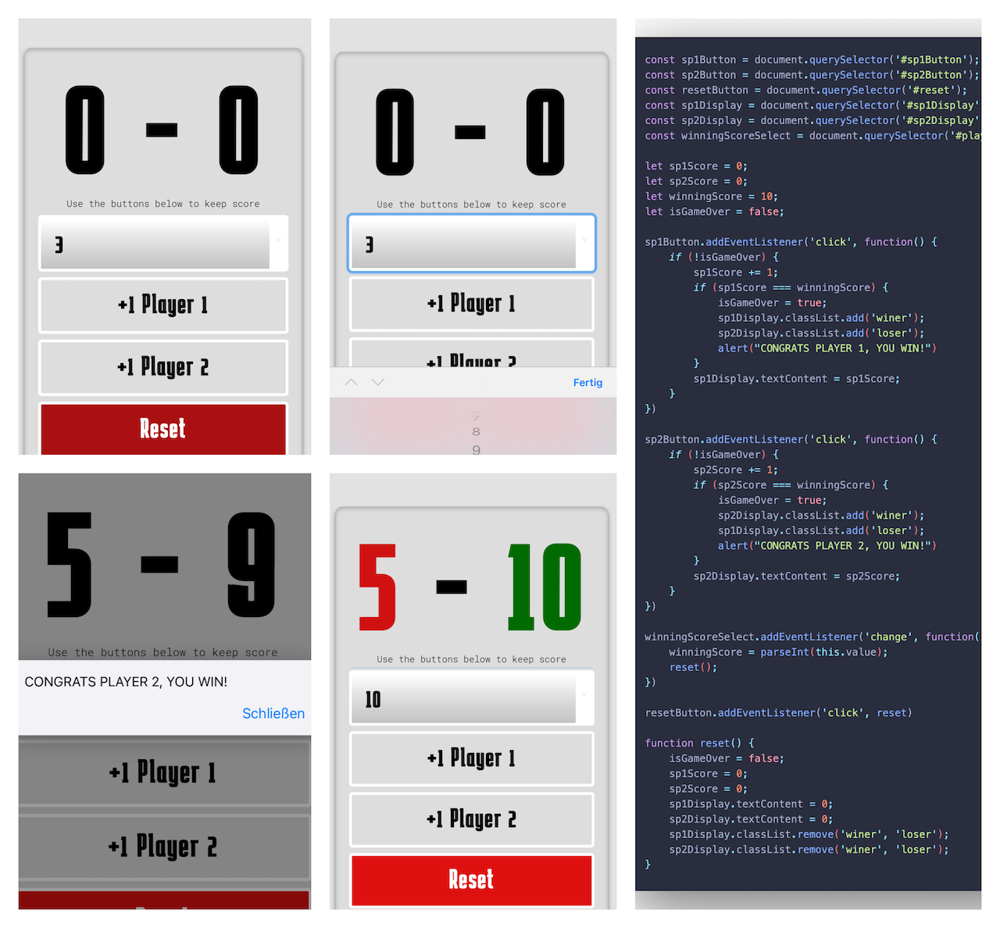

# ScoreKeeper 2.0 mobile

You want to play a game of ping-pong or something similar? Of course, nowadays the points are no longer simply written down somewhere, but the cell phone must be used! Twitter, Instagram posts & snaps have to come. Scorekeeper2.0 is very easy to use.

1. Choose at how many points a player wins the game.
2. Every time you or your opponent scores a point, just tap on player 1 or player 2. The points     will be added.
3. The winner is the first to reach the maximum score of 10.

**Have fun with this "web-application".**
_for all mobilephones and tables!_

I am quite new in this world of coding. I’m also so very open and grateful for tips and suggestions for improvement and learn how to code.

Improvement for the Score-Keeper 2.0 will be updated little by little.

#happycoding #codelife
@\_wlsp

